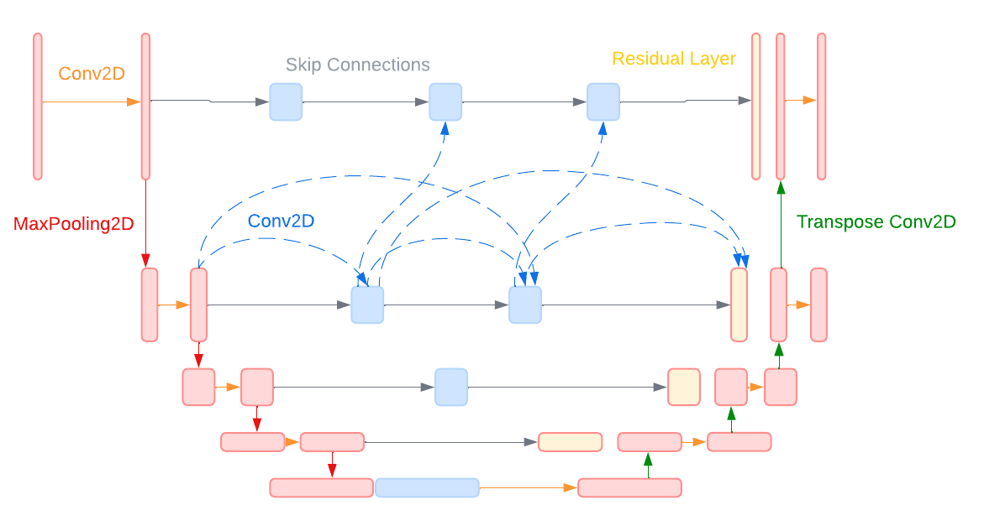

# Final Project

Team: AfroPixel 
Members: Audrey Nguyen, David Ning, Tim Yuan, Vincent Thai 

## INTRODUCTION

This is the repository for Afropixel's CS 175 final project on classifying electrified and unelectrified Sub-Saharan settlements via satelite imagery. It contains scripts for preprocessing the IEEE GRSS dataset, visualizing plots, tiles, and predictions, training models via Pytorch Lightning, and evaluating the predictions of trained models. Also included is the link to the parameter file for our UnetPlusPlus model, our best performing model and the basis of our Tech Memo. 

Below is an image of what the general pipeline looks like for handling the data and training a working model.

## PREPROCESSING
Included are scripts for preprocessing the IEEE GRSS dataset. These scripts are located in the *src/preprocessing* directory. The script *file_utils.py* handles serializing and deserializing data from disk, *preprocess_sat.py* cleans and preprocesses satellite data to make it easier to work with, and *subtile_esd_hw02.py* splits image data into subtiles so that our model can load in and classify parts of the image.

## VISUALIZATION
Scripts for visualization of satellite data are included in *src/visualization*. The script *plot_utils.py* plots satellite images as well as histograms, ground truths, and other metadata for specific images, satellites, and satellite bands. Also included is *restitch_plot.py*, which takes in subtiles and restitches them together to assemble an rgb satellite image, the ground truth, and the model prediction in one row.

Below are examples of histograms, ground truth tiles, max projection plots and plots reconstructed from satellite bands. 

## TRAINING
Training is handled via Pytorch Lightning, and metrics are measured and kept track of using Weights and Biases (Wandb). Scripts and settings for training are located in the *scripts* directory. A .yaml file stores user settings for training, and *train_sweeps.py* works as a "wrapper script" for executing the entire training and metric tracking pipeline. 

Supporting functions and modules are located in the *src/models* or *src/esd_data* directories. For instance, dataset augmentation via image transformation is located in the *augmentations.py* script inside *src/esd_data*. Custom implementation of Pytorch's dataset, dataloader, and datamodule classes are located inside also located inside *src/esd_data*. Implementations of model architectures are located in *src/models*. More detail on how to train a model is shown in the **Quick Start** section.

Below is an example of what data augmentation for a satellite image would look like.

Below is an example of what the output for restitching subtiles would look like.

## PREDICTION AND VALIDATION
Model evaluation is performed by calling the *evaluate.py* script inside the *scripts* directory. To evaluate a specific model, you will need its corresponding .ckpt file that stores its parameters. Call *evaluate.py* with the path to your ckpt file. The validation accuracy will be outputted, and the predictions, compared to the ground truth and real satellite image, are sent as an image file to the *data/model/predictions* directory, where "model" is the name of the model you wanted to evaluate. Below is what the image output would look like.

## Quick Start:
1. Navigate to the project directory in your terminal.
2. Create a virtual environment:
``python3 -m venv esdenv``
3. Activate the virtual environment:
    * On macOS and Linux

        ``source esdenv/bin/activate``
    * On Windows:

        ``.\esdenv\Scripts\activate``
4. Install the required packages: ``pip install -r requirements.txt``

    To deactivate the virtual environment, type ``deactivate``

5. Run training with the hyperparameter sweeps

    `` python train_sweeps.py --sweep_file=sweeps.yml``
    
6. Run 
noitadila

## UNET++ Parameters Link
We will include an example of our best-performing model, UNet++. We used its architecture and results for our tech memo. Below is an image of UNet++'s architecture. 

The parameter file for our final UNet++ model is approximately 300 megabytes, and thus cannot fit into this repository. To circumvent this limitation, we include a link to the parameter file below.
[Link to UNet++ Parameters](https://drive.google.com/drive/folders/1Awdv0pgzDclMZ89YWAD3tFwo9_4IDBUW?usp=sharing)